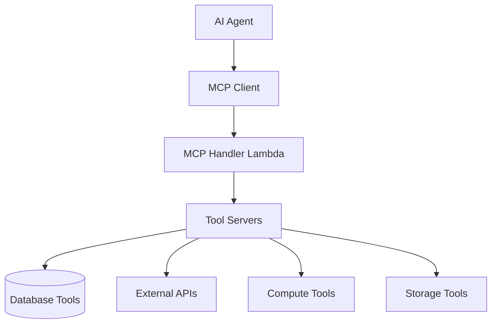
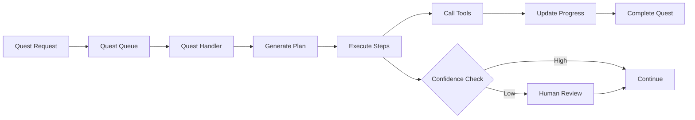
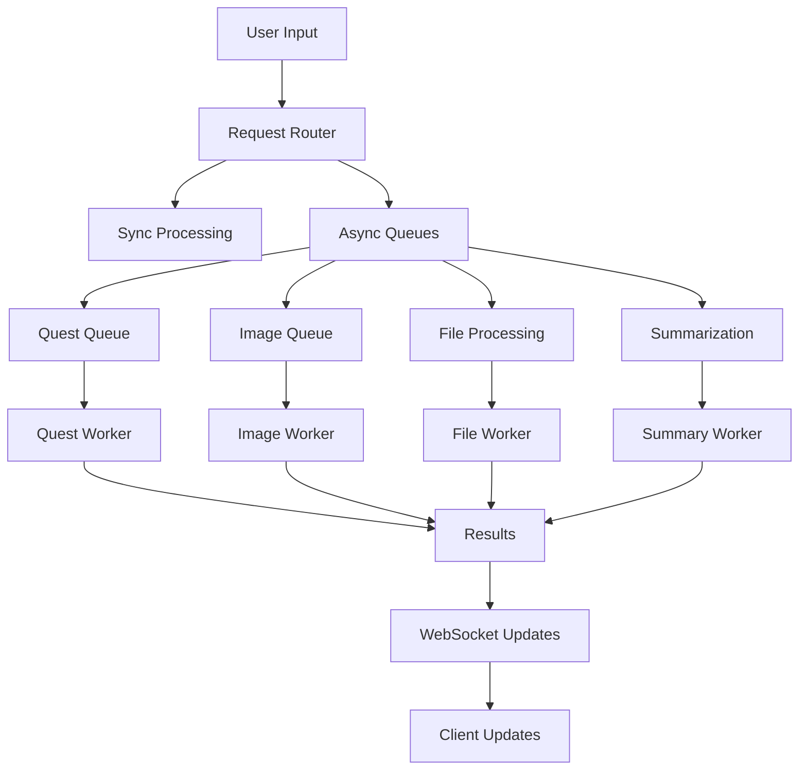
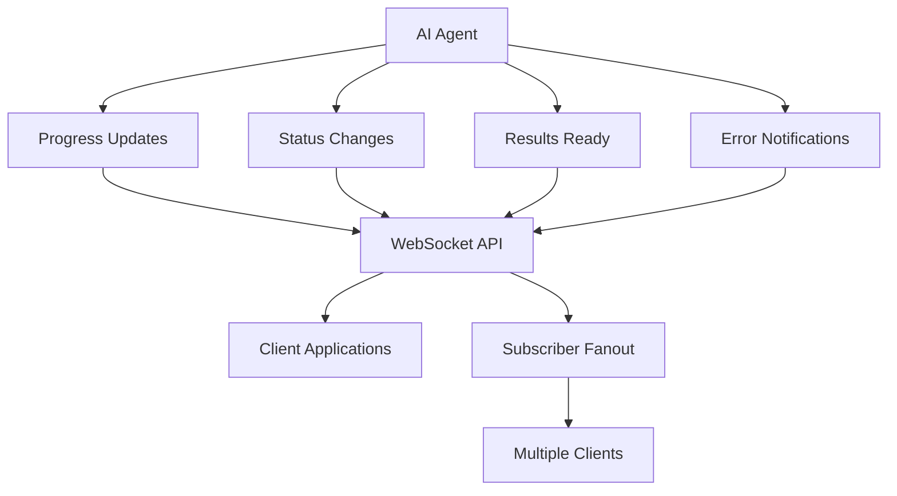

# AI Agent Architecture

## Overview

Bike4Mind's AI agent architecture is designed for semi-autonomous operation with intelligent human-in-the-loop integration. The system leverages multiple AI providers, queue-based processing, and the Model Context Protocol (MCP) for standardized tool integration.

## Agent Foundation Components

### Multi-LLM Integration

The system supports multiple AI providers through a unified `ChatCompletionService`:

```typescript
// Current LLM Support
- OpenAI GPT-4: Primary reasoning and conversation
- Anthropic Claude: Large context analysis and safety
- Amazon Bedrock: AWS-native AI services  
- Google Gemini: Alternative reasoning capabilities
```

#### LLM Selection Strategy
- **Primary**: OpenAI GPT-4 for general reasoning and conversation
- **Fallback**: Anthropic Claude for safety-critical decisions
- **Specialized**: Bedrock for image generation and AWS-native tasks
- **Alternative**: Gemini for diverse perspective and cost optimization

### Model Context Protocol (MCP) Integration

#### MCP Architecture


#### MCP Implementation
- **`mcpHandler` Lambda**: Central tool execution endpoint
- **Dynamic Tool Discovery**: Runtime tool registration and execution
- **Environment Management**: Secure environment variable handling for tools
- **Standardized Interface**: Consistent tool calling across different implementations

#### Tool Categories
1. **Database Tools**: Query and manipulate MongoDB collections
2. **File Processing Tools**: Handle file uploads, chunking, and vectorization
3. **External API Tools**: Integrate with third-party services
4. **Compute Tools**: Perform calculations and data processing
5. **Communication Tools**: Send notifications and messages

### Quest System Architecture

#### Quest Execution Flow


#### Quest Components
- **QuestModel**: Database entity tracking quest state and progress
- **QuestMasterPlanModel**: Structured execution plans with steps
- **Progress Tracking**: Real-time updates via WebSocket
- **Error Recovery**: Comprehensive retry logic and error handling

### Agent Memory Systems

#### Structured Memory (MongoDB)
```typescript
// Core Memory Models
interface AgentMemory {
  sessions: SessionModel[];      // Conversation history
  mementos: MementoModel[];     // Knowledge base entries
  fabFiles: FabFileModel[];     // Processed documents
  projects: ProjectModel[];     // User projects and context
  users: UserModel[];          // User preferences and history
}
```

#### Vector Memory (File Processing Pipeline)
- **Chunking Pipeline**: Automated document chunking via `fabFileChunkQueue`
- **Vectorization**: Embedding generation via `fabFileVectQueue`
- **Semantic Search**: Vector-based content retrieval
- **Context Assembly**: Dynamic context building for agent queries

#### Memory Retrieval Strategy
1. **Immediate Context**: Current session and recent interactions
2. **Semantic Retrieval**: Vector search for relevant content
3. **Structured Queries**: Database queries for specific data
4. **User Preferences**: Personalization based on user history

## Queue-Based AI Processing

### Processing Architecture


### Queue Configuration

| Queue | Timeout | Concurrency | DLQ | Purpose |
|-------|---------|-------------|-----|---------|
| `questStartQueue` | 10min | Default | ✓ | AI quest execution and planning |
| `imageGenerationQueue` | 10min | Default | ✓ | AI image generation via Bedrock |
| `imageEditQueue` | 10min | Default | ✓ | AI image editing and manipulation |
| `notebookSummarizationQueue` | 2min | Default | - | Content summarization |
| `notebookTaggingQueue` | 2min | Default | - | Automated content tagging |
| `fabFileChunkQueue` | 13min | Default | ✓ | Document chunking and processing |
| `fabFileVectQueue` | 5min | 5 | ✓ | Vector embedding generation |

### Error Handling & Recovery
- **Dead Letter Queues**: Failed messages for manual review
- **Retry Logic**: Exponential backoff with configurable attempts
- **Circuit Breakers**: Prevent cascade failures
- **Monitoring**: CloudWatch metrics and Slack notifications

## Real-Time Agent Communication

### WebSocket Integration


#### WebSocket Handlers
- **Quest Progress**: Real-time quest execution updates
- **Tool Execution**: Live tool calling status
- **Error Notifications**: Immediate error reporting
- **Result Delivery**: Streaming results as they become available

#### Subscriber Fanout Service
- **ECS Fargate Service**: Dedicated real-time message distribution
- **MongoDB Change Streams**: Database change detection
- **Efficient Broadcasting**: Optimized message delivery to connected clients

## Human-in-the-Loop Integration

### Confidence-Based Handoffs

#### Multi-Dimensional Scoring
```typescript
interface ConfidenceScore {
  complexity: number;      // Task complexity (0-1)
  permission: number;      // Permission level required (0-1)
  risk: number;           // Risk assessment (0-1)
  emotional: number;      // Emotional sensitivity (0-1)
  confidence: number;     // AI confidence in result (0-1)
}
```

#### Handoff Triggers
1. **Low Confidence**: AI uncertainty about task execution
2. **High Risk**: Actions with significant consequences
3. **Permission Required**: Tasks requiring explicit user approval
4. **Emotional Context**: Sensitive or personal content
5. **Complex Decisions**: Multi-step decisions with dependencies

### User Interaction Patterns

#### Approval Workflows
- **Plan Approval**: Present execution plan before starting
- **Step-by-Step**: Request approval for each major action
- **Result Review**: Allow user to review before finalizing
- **Modification Requests**: Enable user to adjust agent actions

#### Communication Channels
- **WebSocket**: Real-time in-app notifications
- **Slack Integration**: Workplace notifications and approvals
- **Email**: Formal notifications and summaries
- **SMS**: Urgent notifications requiring immediate attention

## Agent Capabilities & Tools

### Current Tool Categories

#### File & Content Processing
- **Document Upload**: Handle various file formats
- **Text Extraction**: Extract text from PDFs, images, documents
- **Chunking**: Break large documents into manageable pieces
- **Vectorization**: Generate embeddings for semantic search
- **Summarization**: Create concise summaries of content
- **Tagging**: Automatic content categorization

#### AI & Generation
- **Text Generation**: Create content using multiple LLMs
- **Image Generation**: Create images via AWS Bedrock
- **Image Editing**: Modify existing images
- **Audio Transcription**: Convert speech to text
- **Translation**: Multi-language content translation

#### Data & Analytics
- **Database Queries**: Search and retrieve user data
- **Report Generation**: Create analytical reports
- **Usage Analytics**: Track system and user metrics
- **Performance Monitoring**: System health and performance

#### Communication & Integration
- **Email Sending**: Automated email notifications
- **Slack Messaging**: Workplace communication
- **Calendar Integration**: Schedule management
- **API Integrations**: Third-party service connections

### Tool Development Framework

#### Adding New Tools
1. **MCP Server Implementation**: Create standardized tool interface
2. **Lambda Function**: Implement tool logic as Lambda function
3. **Environment Configuration**: Set up secure environment variables
4. **Registration**: Register tool with MCP handler
5. **Testing**: Comprehensive tool testing and validation

#### Tool Security
- **Permission Scoping**: Tools respect user permissions
- **Input Validation**: Comprehensive input sanitization
- **Output Filtering**: Sensitive data protection
- **Audit Logging**: Complete tool usage tracking

## Agent Learning & Adaptation

### Feedback Integration
- **User Corrections**: Learn from user modifications
- **Success Tracking**: Monitor task completion rates
- **Error Analysis**: Analyze and learn from failures
- **Preference Learning**: Adapt to user preferences over time

### Memory Enhancement
- **Session Summarization**: Automatic session summaries
- **Knowledge Extraction**: Extract key insights from interactions
- **Pattern Recognition**: Identify recurring user needs
- **Context Building**: Improve context assembly over time

## Performance & Optimization

### Latency Optimization
- **Async Processing**: Non-blocking operations for long tasks
- **Caching**: Intelligent caching of frequent operations
- **Connection Pooling**: Efficient database connections
- **CDN Integration**: Fast content delivery

### Cost Optimization
- **Model Selection**: Choose appropriate model for task complexity
- **Batch Processing**: Group similar operations
- **Resource Scaling**: Dynamic resource allocation
- **Usage Monitoring**: Track and optimize AI service costs

### Scalability Considerations
- **Horizontal Scaling**: Lambda auto-scaling
- **Queue Management**: Handle high-volume processing
- **Database Optimization**: Efficient queries and indexing
- **Load Balancing**: Distribute processing load

## Future Agent Enhancements

### Advanced Capabilities
- **Multi-Agent Coordination**: Specialized agents working together
- **Autonomous Goal Setting**: Agents setting their own objectives
- **Self-Reflection**: Agents evaluating their own performance
- **Skill Libraries**: Reusable agent capabilities
- **Code Generation**: Agents writing their own tools

### Integration Opportunities
- **External Agent Protocols**: A2A (Agent-to-Agent) integration
- **Tool Marketplaces**: Third-party tool integration
- **Agent Collaboration**: Cross-system agent communication
- **Advanced Memory**: Long-term learning and adaptation

This AI agent architecture provides a robust foundation for semi-autonomous operation while maintaining appropriate human oversight and control. 