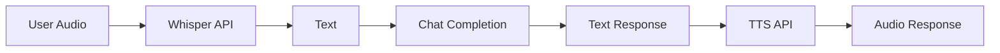
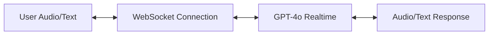
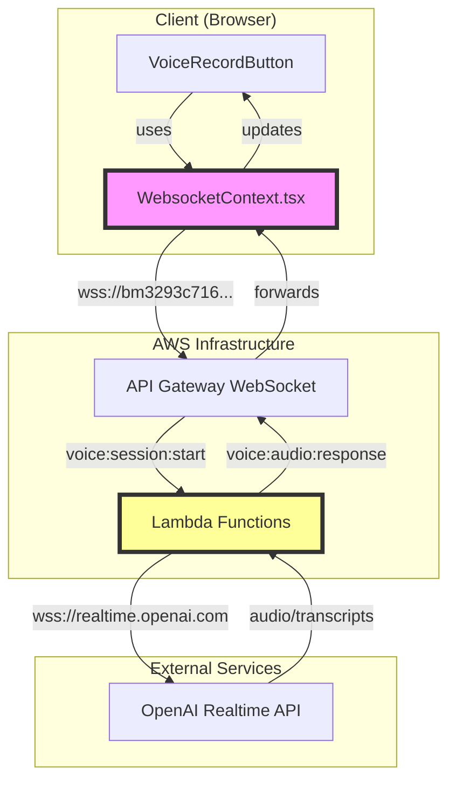

# Real-time API Integration Architecture

## 🎯 Overview

OpenAI's real-time API represents a paradigm shift - it's a **unified bidirectional audio/text API** that replaces the need for separate Whisper (STT) and TTS calls. This document outlines how to integrate it into Bike4Mind's existing infrastructure.

## 🔄 What Makes Real-time API Different

### Traditional Flow (Current)


### Real-time API Flow (New)


## 🏗️ Integration Architecture

### 1. Model Infrastructure Updates ✅

```typescript
// Already added to models.ts:
GPT4O_REALTIME_PREVIEW = 'gpt-4o-realtime-preview-2024-12-17'
GPT4O_REALTIME = 'gpt-4o-realtime'
```

### 2. New Real-time Backend Implementation

Since the real-time API uses WebSockets instead of REST, we need a parallel infrastructure:

```typescript
// New file: b4m-core/utils/src/llm/realtimeBackend.ts
export class OpenAIRealtimeBackend {
  private ws: WebSocket;
  private session: RealtimeSession;
  
  async connect(apiKey: string, sessionConfig: SessionConfig) {
    // WebSocket connection to wss://api.openai.com/v1/realtime
    this.ws = new WebSocket('wss://api.openai.com/v1/realtime', {
      headers: {
        'Authorization': `Bearer ${apiKey}`,
        'OpenAI-Beta': 'realtime=v1'
      }
    });
  }

  // Handle bidirectional audio/text streaming
  async streamConversation(options: RealtimeOptions) {
    // Send session.update for configuration
    // Handle input_audio_buffer.append for audio chunks
    // Process response.audio.delta events
  }
}
```

### 3. Voice Agent Feature Integration

```typescript
// New feature: VoiceAgentFeature in ChatCompletionFeatures.ts
export class VoiceAgentFeature implements ChatCompletionFeature {
  private realtimeBackend: OpenAIRealtimeBackend;
  
  async beforeDataGathering({ model }) {
    // Check if model is real-time capable
    if (model === ChatModels.GPT4O_REALTIME_PREVIEW) {
      // Switch to WebSocket-based processing
      return { shouldContinue: false, useRealtime: true };
    }
    return { shouldContinue: true };
  }
}
```

## 🔗 Two-Layer WebSocket Architecture

### Why Two WebSocket Connections?

A common surprise when implementing the real-time API is discovering we need **two separate WebSocket connections**. Here's why:



### The Architecture Layers

1. **Client ↔ Your Backend** (Existing WebSocket)
   - Uses `WebsocketContext.tsx` (React Context)
   - Connects to AWS API Gateway
   - Handles authentication, session management
   - Routes voice-specific messages

2. **Your Backend ↔ OpenAI** (New WebSocket)
   - Uses `ws` npm package (Node.js)
   - Connects to OpenAI's real-time API
   - Requires server-side implementation
   - Manages OpenAI session lifecycle

### Why Not Connect Directly?

You might wonder: "Why not connect the browser directly to OpenAI?" Several critical reasons:

1. **Security**: OpenAI API keys must stay server-side
2. **Authentication**: Need to verify user permissions
3. **Monitoring**: Track usage, costs, and errors
4. **Customization**: Add pre/post-processing logic
5. **Resilience**: Handle disconnections gracefully

### The `ws` Package Requirement

```javascript
// ❌ In Browser (Native WebSocket)
const ws = new WebSocket('wss://...'); // Works!

// ❌ In Node.js (No Native WebSocket)
const ws = new WebSocket('wss://...'); // Error: WebSocket is not defined

// ✅ In Node.js (With ws package)
import WebSocket from 'ws';
const ws = new WebSocket('wss://...'); // Works!
```

**Why this matters:**
- Browsers have native WebSocket support
- Node.js (Lambda functions) doesn't
- The `ws` package provides WebSocket for Node.js
- Both layers use WebSocket, but different implementations

### Benefits of the Proxy Architecture

1. **Security Layer**
   ```
   Client → [Auth Check] → Lambda → [API Key] → OpenAI
   ```

2. **Cost Control**
   ```typescript
   // Can implement per-user limits
   if (user.minutesUsed > user.limit) {
     return { error: 'Usage limit exceeded' };
   }
   ```

3. **Custom Processing**
   ```typescript
   // Pre-process audio
   audioData = removeBackgroundNoise(audioData);
   // Forward to OpenAI
   openaiWs.send(audioData);
   ```

4. **Unified Logging**
   ```typescript
   // Log all interactions
   logger.info('Voice session', {
     userId,
     duration,
     tokensUsed,
     cost
   });
   ```

### Implementation Example

```typescript
// Lambda Function (Server-Side)
import WebSocket from 'ws'; // Required for Node.js

export const voiceSessionStart = async (event) => {
  // 1. Verify user authentication
  const user = await authenticateWebSocketConnection(event);
  
  // 2. Create OpenAI connection (needs ws package)
  const openaiWs = new WebSocket('wss://api.openai.com/v1/realtime', {
    headers: {
      'Authorization': `Bearer ${OPENAI_API_KEY}`,
      'OpenAI-Beta': 'realtime=v1'
    }
  });
  
  // 3. Proxy messages between client and OpenAI
  openaiWs.on('message', (data) => {
    // Forward to client via AWS WebSocket
    await apiGateway.postToConnection({
      ConnectionId: connectionId,
      Data: JSON.stringify({
        action: 'voice.audio.response',
        data
      })
    });
  });
};
```

## 📡 Real-time Session Management

### Session Configuration
```typescript
interface RealtimeSessionConfig {
  model: 'gpt-4o-realtime-preview-2024-12-17';
  voice: 'echo' | 'alloy' | 'shimmer';
  instructions?: string;
  input_audio_format: 'pcm16' | 'g711_ulaw' | 'g711_alaw';
  output_audio_format: 'pcm16' | 'g711_ulaw' | 'g711_alaw';
  input_audio_transcription?: {
    model: 'whisper-1';
  };
  turn_detection?: {
    type: 'server_vad';
    threshold?: number;
    silence_duration_ms?: number;
  };
  tools?: Tool[];
}
```

### Event Flow
```typescript
// Client → Server Events
'session.update'          // Update session configuration
'input_audio_buffer.append'  // Stream audio chunks
'input_audio_buffer.commit'  // Finalize audio input
'conversation.item.create'   // Add text/audio items
'response.create'            // Trigger model response

// Server → Client Events
'session.created'         // Session initialized
'session.updated'         // Config confirmed
'conversation.item.created'  // New conversation item
'response.audio.delta'    // Streaming audio chunks
'response.text.delta'     // Streaming text
'response.function_call'  // Tool use
```

## 🔌 Integration Points

### 1. Model Selection Logic
```typescript
// In ChatCompletion.ts process() method
if (isRealtimeModel(model)) {
  // Route to real-time WebSocket handler
  return this.processRealtimeSession(quest, model, options);
}
```

### 2. Voice Recording Integration
```typescript
// Enhance existing VoiceRecordButton
<VoiceRecordButton
  onRecordingStart={() => {
    if (selectedModel.includes('realtime')) {
      // Start WebSocket streaming
      startRealtimeSession();
    }
  }}
  streamAudio={true} // New prop for real-time streaming
/>
```

### 3. Agent Personality Injection
```typescript
// Use existing agent system prompts
const realtimeConfig = {
  instructions: agent.systemPrompt,
  voice: agent.voiceId || 'echo',
  // ... other config
};
```

## 💰 Pricing Considerations

Real-time API pricing is **usage-based**:
- **Audio Input**: $0.06/minute
- **Audio Output**: $0.24/minute  
- **Text Input**: $5.00/1M tokens
- **Text Output**: $20.00/1M tokens

This is significantly more expensive than separate Whisper + Chat + TTS, but provides:
- Lower latency
- Natural interruptions
- Better conversation flow
- Unified context

## 🚀 Implementation Phases

### Phase 1: Basic Integration
1. Add models to registry ✅
2. Create RealtimeBackend class
3. Add WebSocket infrastructure
4. Basic audio streaming

### Phase 2: Feature Parity
1. Tool/function calling support
2. Agent personality integration
3. Context window management
4. Interruption handling

### Phase 3: Advanced Features
1. Multi-agent conversations
2. Voice cloning/customization
3. Emotion detection
4. Background audio handling

## 🔧 Code Example

```typescript
// Example usage in a voice agent
const voiceAgent = new VoiceAgent({
  model: ChatModels.GPT4O_REALTIME_PREVIEW,
  voice: 'shimmer',
  agent: myAgent,
  onAudioDelta: (audioData) => {
    // Stream to user's speakers
    audioPlayer.append(audioData);
  },
  onTranscript: (text) => {
    // Update UI with transcription
    updateChatUI(text);
  },
  onToolCall: async (tool, args) => {
    // Handle function calls
    return await executeToolCall(tool, args);
  }
});

// Start conversation
await voiceAgent.startConversation();
```

## 🎯 Key Benefits

1. **Unified Pipeline**: No more juggling Whisper → GPT → TTS
2. **Lower Latency**: ~320ms vs 1-2s for traditional pipeline
3. **Natural Interruptions**: Users can interrupt mid-response
4. **Consistent Context**: Audio and text share the same context
5. **Native Voice**: Purpose-built for voice, not text-adapted

## ⚠️ Current Limitations

1. No vision support (yet)
2. Limited to specific models
3. Higher cost than traditional pipeline
4. WebSocket complexity
5. No audio file inputs (streaming only)

## 🔮 Future Enhancements

1. **Vision Support**: When OpenAI adds it
2. **Custom Voices**: Voice cloning API
3. **Multilingual**: Automatic language detection
4. **Offline Mode**: Local real-time models
5. **Group Calls**: Multi-party conversations 