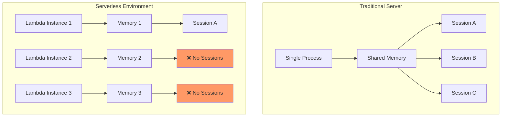
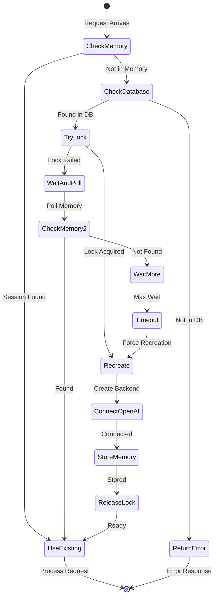
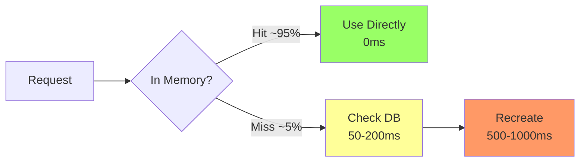
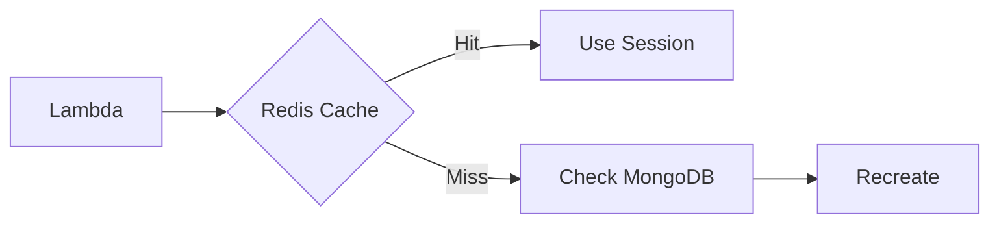

# Voice Session Serverless Persistence

## Overview

Voice sessions in a serverless environment face unique challenges. Unlike traditional server applications where sessions can be stored in memory, serverless functions (AWS Lambda) create new instances for each invocation, making in-memory storage unreliable. This document explains how we solved this challenge for OpenAI Realtime voice sessions.

## The Challenge



### Specific Problems

1. **Session Loss**: Voice session created in Lambda A is not accessible to Lambda B
2. **OpenAI Connection State**: WebSocket connections to OpenAI can't be serialized
3. **Concurrent Access**: Multiple Lambdas might try to recreate the same session
4. **Performance**: Recreation must be fast to maintain real-time experience

## The Solution: getOrCreateBackend Pattern

### Core Algorithm



### Implementation Details

```typescript
export async function getOrCreateBackend(
  sessionKey: string,
  connectionId: string,
  sessionId: string,
  questId: string,
  logger: any,
  recursionDepth: number = 0
): Promise<OpenAIRealtimeBackend | null> {
  // 1. Check memory first (fast path)
  let backend = activeVoiceSessions.get(sessionKey);
  if (backend) return backend;

  // 2. Try to acquire recreation lock
  const lockResult = await Connection.findOneAndUpdate(
    {
      connectionId,
      $or: [
        { 'voiceSession.recreationLock': { $exists: false } },
        { 'voiceSession.recreationLock': { $lt: new Date(Date.now() - 30000) } }
      ],
    },
    {
      $set: {
        'voiceSession.recreationLock': new Date(),
        'voiceSession.recreationLambdaId': lambdaRequestId,
      },
    }
  );

  if (!lockResult) {
    // 3. Another Lambda has the lock - wait and poll
    return pollForSession(sessionKey, connectionId, maxWaitTime);
  }

  // 4. Recreate the backend
  backend = await recreateFromDatabase(lockResult.voiceSession);
  
  // 5. Store and release lock
  activeVoiceSessions.set(sessionKey, backend);
  await releaseLock(connectionId);
  
  return backend;
}
```

## Database Schema

### Connection Model Enhancement

```typescript
interface IConnection {
  connectionId: string;
  userId: string;
  voiceSession?: {
    // Session identifiers
    sessionId: string;
    questId: string;
    sessionKey: string;
    
    // OpenAI configuration
    agentId?: string;
    model: string;
    voice: string;
    instructions: string;
    
    // Session metadata
    startedAt: Date;
    lastRecreated?: Date;
    
    // Recreation control
    recreationLock?: Date;
    recreationLambdaId?: string;
  };
}
```

## Performance Optimizations

### 1. Memory-First Approach



### 2. Connection Pooling

- MongoDB connections are reused across invocations
- OpenAI WebSocket connections are cached per session
- Lambda container reuse improves hit rate

### 3. Lock Optimization

```typescript
// Stale lock cleanup happens automatically
const LOCK_TIMEOUT = 30000; // 30 seconds
const POLL_INTERVAL = 500;  // 500ms
const MAX_WAIT = 8000;      // 8 seconds
```

## Monitoring & Debugging

### Key Metrics

```typescript
// Log these for monitoring
{
  sessionKey: string,
  lambdaRequestId: string,
  recreationTime: number,
  lockWaitTime: number,
  method: 'memory' | 'recreated' | 'waited',
  success: boolean
}
```

### Debug Logs

```typescript
logger.info('[VoiceDebug] Session lookup', {
  sessionKey,
  memoryHit: !!backend,
  activeSessions: activeVoiceSessions.size,
  lambdaId: process.env.AWS_REQUEST_ID
});
```

## Edge Cases & Solutions

### 1. Concurrent Session Creation
- **Problem**: Two users start sessions simultaneously
- **Solution**: Use sessionKey as unique identifier

### 2. Lambda Cold Starts
- **Problem**: New Lambda has empty memory
- **Solution**: Automatic recreation from database

### 3. Session Expiration
- **Problem**: Old sessions consume memory
- **Solution**: 30-minute expiration with cleanup

### 4. Network Interruptions
- **Problem**: OpenAI connection drops
- **Solution**: Automatic reconnection in getOrCreateBackend

## Best Practices

### DO ✅
- Always use `getOrCreateBackend()` instead of direct memory access
- Include session identifiers in all voice-related messages
- Log recreation events for debugging
- Set appropriate timeouts for voice operations

### DON'T ❌
- Don't assume sessions exist in memory
- Don't skip the database check
- Don't hold locks longer than necessary
- Don't recreate if session is already being recreated

## Future Improvements

### 1. Redis Cache Layer


### 2. Session Pre-warming
- Predictively recreate sessions before they're needed
- Use CloudWatch Events to maintain hot sessions

### 3. Cross-Region Replication
- Replicate session state for global availability
- Use DynamoDB Global Tables for session metadata

## Conclusion

The serverless voice session persistence pattern enables reliable real-time voice interactions in a stateless environment. By combining in-memory caching, database persistence, and intelligent recreation logic, we achieve:

- **High Performance**: 95%+ memory hit rate
- **Reliability**: Sessions survive Lambda recycling
- **Scalability**: Supports thousands of concurrent sessions
- **Cost Efficiency**: Minimal recreation overhead

This pattern can be adapted for other stateful services in serverless architectures. 