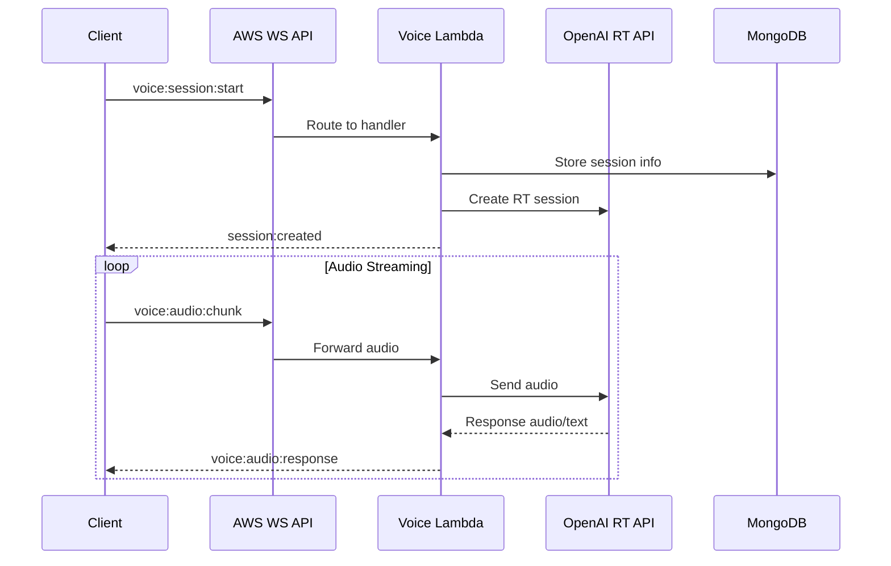

# WebSocket Architecture Review & Real-time Voice Integration

## Existing WebSocket Infrastructure

### Overview
Bike4Mind uses AWS API Gateway WebSocket API managed through SST (Serverless Stack) for real-time communication. This infrastructure powers data synchronization, live updates, and real-time features across the application.

### Architecture Components

#### 1. **Server-Side Infrastructure** (SST/AWS)
- **AWS API Gateway WebSocket API**: Managed WebSocket connections
- **Lambda Functions**: Handle WebSocket events
- **MongoDB**: Stores active connections and subscriptions
- **Route Handlers**:
  - `$connect`: Authentication and connection establishment
  - `$disconnect`: Cleanup and user status updates
  - `heartbeat`: Keep-alive mechanism
  - `dataSubscribeRequest`: Subscribe to data collections
  - `dataUnsubscribeRequest`: Unsubscribe from data

#### 2. **Client-Side Infrastructure**
- **WebSocketContext**: React context using `react-use-websocket`
- **Authentication**: JWT tokens passed as query parameters
- **State Management**: Zustand for last message state
- **Subscription System**: Action-based message routing

#### 3. **Message Protocol**
```typescript
// Client → Server
type IMessageDataToServer = 
  | DataSubscribeRequestAction
  | DataUnsubscribeRequestAction  
  | HeartbeatAction

// Server → Client
type IMessageDataToClient =
  | DataSubscriptionUpdateAction
  | StreamedChatCompletionAction
  | UpdateFabFileChunkVectorStatusAction
  | ... // other action types
```

### Key Features
1. **Authentication**: JWT-based with token rotation support
2. **Data Subscriptions**: MongoDB change stream integration
3. **Permissions**: CASL-based access control
4. **Throttling**: Built-in message throttling
5. **Connection Management**: Automatic cleanup on disconnect
6. **Error Handling**: Robust error handling with logging

## Real-time Voice Integration Analysis

### Current Divergence
The initial real-time voice implementation created a separate Socket.IO-based system, which is:
- **Incompatible** with existing AWS WebSocket infrastructure
- **Redundant** - duplicates authentication, connection management
- **Inconsistent** - different message patterns and protocols

### Recommended Integration Approach

#### Option 1: Extend Existing WebSocket API (Recommended) ✅
Integrate voice capabilities into the existing AWS WebSocket infrastructure:

**Advantages**:
- Leverages existing authentication and connection management
- Consistent with current architecture
- No additional infrastructure needed
- Unified message protocol

**Implementation**:
1. Add new WebSocket routes for voice:
   ```typescript
   // In sst.config.ts
   websocketApi.addRoutes(stack, {
     'voice:connect': { ... },
     'voice:audio': { ... },
     'voice:text': { ... },
     'voice:control': { ... }
   });
   ```

2. Extend message types:
   ```typescript
   // New actions for voice
   export const VoiceSessionStartAction = z.object({
     action: z.literal('voice:session:start'),
     sessionId: z.string(),
     questId: z.string(),
     agentId: z.string().optional(),
     model: z.enum(['gpt-4o-realtime-preview-2024-12-17', 'gpt-4o-realtime'])
   });
   
   export const VoiceAudioChunkAction = z.object({
     action: z.literal('voice:audio:chunk'),
     sessionId: z.string(),
     audioData: z.string() // base64 encoded PCM16
   });
   ```

3. Create voice session manager Lambda:
   ```typescript
   // apps/client/server/websocket/voiceSessionManager.ts
   export async function handleVoiceSession(event, context) {
     // Manage OpenAI real-time connections
     // Bridge between client WebSocket and OpenAI WebSocket
   }
   ```

#### Option 2: Separate Voice Service
Create a dedicated voice service that communicates with the main app:

**Advantages**:
- Isolation of voice-specific logic
- Can use specialized infrastructure
- Independent scaling

**Disadvantages**:
- Additional complexity
- Separate authentication needed
- Cross-service communication overhead

## Proposed Integration Architecture

### 1. **Voice Session Flow**


### 2. **Lambda Architecture**
```
apps/client/server/websocket/
├── voice/
│   ├── sessionManager.ts      # Manages voice sessions
│   ├── audioHandler.ts        # Handles audio streaming
│   ├── realtimeClient.ts      # OpenAI RT WebSocket client
│   └── types.ts               # Voice-specific types
```

### 3. **State Management**
- **Session State**: Stored in MongoDB with TTL
- **Audio Buffers**: In-memory with Redis fallback
- **Connection Mapping**: Client WS ↔ OpenAI WS

## Migration Plan

### Phase 1: Remove Divergent Implementation
1. Remove `apps/client/pages/api/realtime/connect.ts`
2. Keep core real-time logic from `b4m-core`
3. Document lessons learned

### Phase 2: Implement Voice Routes
1. Add voice routes to WebSocket API
2. Create voice session Lambda handlers
3. Extend message types

### Phase 3: Client Integration
1. Extend WebSocketContext for voice
2. Add voice-specific hooks
3. Update UI components

### Phase 4: Testing & Optimization
1. End-to-end voice testing
2. Latency optimization
3. Error handling improvements

## Technical Considerations

### 1. **Audio Streaming**
- AWS API Gateway has 128KB frame size limit
- May need to chunk audio data
- Consider compression for bandwidth

### 2. **Connection Management**
- OpenAI RT connections are stateful
- Need connection pooling/reuse strategy
- Handle reconnection gracefully

### 3. **Cost Optimization**
- Lambda duration charges for long connections
- Consider AWS Fargate for persistent connections
- Monitor and optimize OpenAI API usage

### 4. **Security**
- Validate audio data format
- Rate limiting on audio endpoints
- Monitor for abuse patterns

## Conclusion

The existing WebSocket infrastructure is robust and well-designed. Rather than creating a parallel system, we should extend it to support real-time voice capabilities. This approach ensures consistency, leverages existing features, and maintains a unified architecture.

The recommended approach is to:
1. Use the existing AWS WebSocket API
2. Add voice-specific routes and handlers
3. Bridge client connections to OpenAI's real-time API
4. Maintain all voice session state in the existing infrastructure

This integration will provide a seamless real-time voice experience while maintaining architectural consistency. 