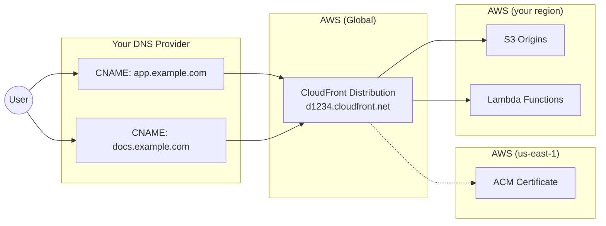

# Custom Domain Migration Guide

## Overview

Migrating your B4M deployment to a custom domain is straightforward and **requires no application code changes**. All configuration is environment-variable driven through SST and GitHub Actions. This guide walks you through the complete migration process.

## Prerequisites

Before beginning the migration, ensure you have:

### Required Access
- [ ] AWS Console access with Route53 and SES permissions
- [ ] GitHub repository admin access (Settings > Secrets and variables)
- [ ] OAuth provider admin access (Okta, Google, GitHub, Slack - as applicable)
- [ ] DNS management access for your target domain

### Required Information
- [ ] Target domain name (e.g., `example.com`)
- [ ] AWS Region for deployment (typically `us-east-2`)
- [ ] List of OAuth providers currently in use

### Technical Requirements
- [ ] SST CLI installed locally (`npm install -g sst`)
- [ ] AWS CLI configured with appropriate profile

## Before You Begin

Review these decisions with your team before starting the migration:

| Decision | Options | Impact |
|----------|---------|--------|
| Domain pattern | `app.yourdomain.com` (standard) | Standard pattern requires no code changes |
| DNS approach | Route53 (standard) / External DNS | External DNS requires manual CNAME setup (see [External DNS Approach](#external-dns-approach-cname--custom-certificate)) |
| Email feature | Yes / No | Determines if SES/DMARC setup is required |
| Stripe integration | Yes / No | Webhook URL updates required if yes |
| Atlassian integration | Yes / No | OAuth callback updates required if yes |

:::info What is "Platform Email"?
"Platform email" means the application sends emails **FROM** your domain (e.g., `notifications@yourcompany.com`). This includes:
- Password reset emails
- User invitation emails
- Session notifications

**If YES:** You need SES setup with SPF/DKIM/DMARC records (see [Email Configuration](#email-configuration-if-using-platform-email))
**If NO (OAuth-only login):** Skip the Email Configuration section

Most deployments DO use platform email for user notifications.
:::

---

## Detecting Active Integrations

If you inherited a deployment or are unsure which integrations are active, here's how to check:

### Stripe (Billing/Subscriptions)

**How to check:**
1. Look for billing/subscription features in the app UI
2. Check SST secrets:
   ```bash
   pnpm sst secret list --stage production | grep STRIPE
   ```
3. If secrets contain actual values (not `"placeholder"`), Stripe is configured

**Impact if active:** Webhook URL must be updated in Stripe Dashboard → Developers → Webhooks

### Atlassian (Jira/Confluence)

**How to check:**
1. In the app, go to Admin → Settings
2. Look for `atlassianClientId` and `atlassianClientSecret` values
3. Or check if users see "Connect to Atlassian" in their profile settings

**Impact if active:** OAuth callback URL must be updated in Atlassian Developer Console

### Google Drive

**How to check:**
1. Look for "Connect Google Drive" option in user settings
2. Uses same OAuth client as Google Login (`GOOGLE_CLIENT_ID`)

**Impact if active:** Add Drive callback URL: `https://app.yourdomain.com/google-drive/callback`

---

## Domain Structure Pattern

B4M uses the `app.${SERVER_DOMAIN}` pattern for domain configuration:

| Environment | SERVER_DOMAIN | Resulting URL |
|-------------|---------------|---------------|
| Production | `example.com` | `https://app.example.com` |
| Staging | `staging.example.com` | `https://app.staging.example.com` |
| Preview/PR | `preview.example.com` | `https://app.pr123.preview.example.com` |
| Docs | (auto) | `https://docs.example.com` |

---

## How APP_URL Works

`APP_URL` is the base URL used for OAuth callbacks, email links, and CSRF protection. It is **automatically derived** from your CloudFront distribution URL based on `SERVER_DOMAIN`.

| Stage | APP_URL Value |
|-------|---------------|
| Development | `http://localhost:3000` |
| Production | `https://app.example.com` (from CloudFront router) |
| Staging | `https://app.staging.example.com` |

:::info No Manual Configuration Required
You do not need to set `APP_URL` manually. SST automatically configures it based on your `SERVER_DOMAIN` environment variable. OAuth callbacks, email links, and other URL-dependent features will use the correct domain after deployment.
:::

**Validation:** The system enforces HTTPS for all non-localhost URLs in production. If OAuth fails with "Invalid redirect URI", verify your `SERVER_DOMAIN` is correctly set in GitHub repository variables.

---

## Choosing Your DNS Approach

B4M supports two DNS configuration approaches:

| Approach | Best For | Complexity |
|----------|----------|------------|
| **Route53 (Standard)** | Full control, new domains, can change nameservers | Lower - SST manages everything |
| **External DNS (CNAME)** | Can't change nameservers, domain managed elsewhere | Higher - manual certificate and DNS setup |

### When to Use External DNS

Use the External DNS approach if:
- You **cannot change your domain's nameservers** to Route53
- Your domain is managed by a corporate DNS team or external provider
- You need to use **CNAME records** instead of delegating the entire zone
- You're migrating gradually and want to keep existing DNS infrastructure

If you can delegate your domain (or a subdomain) to Route53, use the standard [Migration Phases](#migration-phases) below.

If you need External DNS, skip to [External DNS Approach](#external-dns-approach-cname--custom-certificate).

---

## Migration Phases

### Phase A: Preparation

#### Milestone 0: Pre-Migration Setup (24-48 hours before)

:::warning DNS Propagation
Lower DNS TTLs 24-48 hours before migration. Forgetting this step can extend rollback time from 15 minutes to several hours.
:::

- [ ] Lower existing domain TTLs to 300 seconds
- [ ] Document/screenshot current OAuth configurations
- [ ] Verify MongoDB Atlas point-in-time recovery is enabled
- [ ] Create manual database snapshot

### Phase B: Infrastructure

#### Milestone 1: AWS Route53 Setup

1. **Create Route53 hosted zone** for your domain
   - AWS Console → Route53 → Hosted zones → Create hosted zone
   - Domain name: `yourdomain.com` (your actual domain)
   - Type: Public hosted zone
   - Click "Create hosted zone"

2. **Verify the hosted zone was created**
   - After creation, click on your hosted zone to view its details
   - The Hosted Zone ID is shown (e.g., `Z0123456789ABCDEFGHIJ`) - AWS uses this internally

   :::tip HOSTED_ZONE uses domain names, not IDs
   GitHub variables like `HOSTED_ZONE` expect domain names (e.g., `example.com`), not zone IDs.
   SST automatically resolves the Route53 zone ID during deployment.
   :::

3. **Update nameservers at your domain registrar**
   - In Route53, view the NS (Name Server) record for your zone
   - Copy all 4 nameserver values (e.g., `ns-123.awsdns-45.com`, `ns-456.awsdns-78.net`, etc.)
   - Go to your domain registrar (GoDaddy, Namecheap, Google Domains, etc.)
   - Find DNS/Nameserver settings for your domain
   - Replace existing nameservers with the 4 Route53 NS values

   :::warning DNS Propagation
   Nameserver changes can take **24-48 hours** to fully propagate. Plan accordingly.
   :::

4. **Verify DNS delegation** (after waiting for propagation)
   ```bash
   dig NS yourdomain.com +short
   # Should return your 4 Route53 nameservers
   ```

5. **SSL certificates** will be auto-provisioned by SST during deployment
   - ACM certificates are created automatically for your domain
   - If you have existing certificates, set `APP_CERT_ARN` in GitHub variables

#### Milestone 2: Configure GitHub Variables

Set these in your fork's repository settings (Settings → Secrets and variables → Actions → Variables):

```bash
SERVER_DOMAIN=example.com
PROD_SERVER_DOMAIN=example.com
STAGING_SERVER_DOMAIN=staging.example.com
PREVIEW_SERVER_DOMAIN=preview.example.com
HOSTED_ZONE=example.com
PROD_HOSTED_ZONE=example.com
```

:::tip S3 CORS is Automatic
S3 bucket CORS configuration is handled automatically by SST infrastructure. When you deploy with a new `SERVER_DOMAIN`, the following buckets automatically update their CORS allowlist:
- `appFilesBucket` (file uploads, profile photos)
- `generatedImagesBucket` (AI-generated images)
- `historyImportBucket` (chat history imports)
- `slackExportBucket` (Slack exports)

No manual S3 CORS configuration is required. See [Troubleshooting > S3 CORS Issues](#s3-cors-issues) if you encounter CORS errors after deployment.
:::

#### Milestone 2.5: CloudFront Cache Policy (if migrating existing deployment)

If you're migrating an existing deployment with custom cache policies, you'll need to preserve them:

1. Get your existing cache policy IDs from AWS CloudFront console
2. Add these GitHub repository variables:
   - `PROD_CACHE_POLICY_ID` - Production cache policy ID
   - `STAGING_CACHE_POLICY_ID` - Staging cache policy ID

:::note New Deployments
For new deployments, SST creates default cache policies automatically. Only set these variables if migrating from an existing CloudFront distribution with custom caching rules.
:::

### Phase C: Identity Provider Updates

#### Milestone 3: OAuth Provider Configuration

:::caution
Do NOT remove old OAuth redirect URIs during migration. Keep them active for 72 hours after successful migration to enable rollback.
:::

Add new redirect URIs to each provider (keep old URIs temporarily):

**Okta:**
1. Admin Console → Applications → Your Application
2. Sign-in redirect URIs → Add:
   - `https://app.example.com/api/auth/okta/callback`
   - `https://app.staging.example.com/api/auth/okta/callback`
3. **Verify:** Assignments tab shows correct user/group assignments
4. **Test:** Complete login flow, verify email claim returned

**Google:**
1. Cloud Console → APIs & Services → Credentials → OAuth 2.0 Client
2. Authorized redirect URIs → Add:
   - `https://app.example.com/api/auth/google/callback`
   - `https://app.example.com/google-drive/callback` (if using Drive integration)
3. Authorized JavaScript origins → Add:
   - `https://app.example.com`
4. **Test:** Complete login flow for both login and Drive (if applicable)

**GitHub:**
1. Settings → Developer settings → OAuth Apps → Your App
2. Authorization callback URL → Update to:
   - `https://app.example.com/api/auth/github/callback`
3. **Test:** Complete OAuth flow

**Slack (two separate OAuth flows):**
1. api.slack.com → Your App → OAuth & Permissions
2. Redirect URLs → Add both:
   - `https://app.example.com/api/slack/oauth/callback` (workspace install)
   - `https://app.example.com/api/slack/oauth/user-link/callback` (user linking)
3. **Test workspace install:** Admin panel → Integrations → Add to Slack
4. **Test user linking:** Profile settings → Link Slack account

**Recommended OAuth Scopes:**

| Provider | Scopes | Purpose |
|----------|--------|---------|
| Okta | `openid email profile` | User identity and email |
| Google Login | `openid email profile` | User identity and email |
| Google Drive | `drive.file` | Access to user-created files only (not full drive) |
| GitHub | `user:email` | User email address |
| Slack | `identity.basic identity.email` | User identity for linking |

### Phase D: Deployment

#### Milestone 4: Deploy Production

Push to `prod` branch to trigger GitHub Actions deployment, or manually run:

```bash
pnpm sst deploy --stage production
```

#### Milestone 5: Validate Production

- [ ] Login page loads at `https://app.example.com`
- [ ] SSL certificate is valid (check padlock in browser)
- [ ] Okta login works
- [ ] Google login works
- [ ] File uploads work
- [ ] WebSocket/real-time features work

#### Milestone 6: Deploy Staging

After production is validated:
1. Add staging OAuth redirect URIs to providers
2. Push to `main` branch to trigger staging deployment
3. Repeat validation steps for staging

### Phase E: Cleanup

#### Milestone 7: Post-Migration Cleanup (after 72 hours stable)

- [ ] Remove old OAuth redirect URIs from all providers
- [ ] Increase DNS TTLs to 3600 seconds (after 72+ hours of stable operation)
- [ ] Update internal documentation

---

## SST Secrets Configuration

Ensure these secrets are set via SST for your deployment:

| Secret | Description | Notes |
|--------|-------------|-------|
| `SECRET_ENCRYPTION_KEY` | AES-256 key for OAuth token encryption (all providers). See [Secrets Reference](/deployment/secrets-reference#about-secret_encryption_key). | Generate with `openssl rand -hex 32` |
| `OKTA_AUDIENCE` | Okta tenant URL | e.g., `https://your-org.okta.com` |
| `OKTA_CLIENT_ID` | Okta OAuth client ID | |
| `OKTA_CLIENT_SECRET` | Okta OAuth client secret | Rotate if shared with old deployment |
| `GOOGLE_CLIENT_ID` | Google OAuth client ID | |
| `GOOGLE_CLIENT_SECRET` | Google OAuth client secret | |
| `SESSION_SECRET` | Signs session cookies | Generate with `openssl rand -base64 48`; do NOT change during migration |
| `JWT_SECRET` | API authentication for bearer tokens | Supports 24-hour grace period during rotation |

:::caution Secrets Stability During Migration
During and immediately after migration:
- **DO NOT rotate** `SESSION_SECRET` — invalidates all active user sessions
- **DO NOT rotate** `JWT_SECRET` — breaks OAuth state tokens and authentication
- **DO NOT rotate** `SECRET_ENCRYPTION_KEY` — requires re-encrypting all stored OAuth tokens

Only rotate OAuth client secrets (`OKTA_CLIENT_SECRET`, `GOOGLE_CLIENT_SECRET`) if the old deployment credentials are compromised or being decommissioned.
:::

:::danger Client Secret Handling
OAuth client secrets are sensitive credentials. Follow these security practices:
- **Never log** client secrets in application code or CI/CD outputs
- **Never commit** secrets to version control (use SST secrets or GitHub encrypted secrets)
- **Never pass** secrets as URL query parameters
- **Rotate immediately** if a secret is exposed

Store all OAuth secrets using `pnpm sst secret set <SECRET_NAME> <value>` or GitHub Actions encrypted secrets.
:::

### Token Security

OAuth tokens are encrypted at rest using `SECRET_ENCRYPTION_KEY`:

| Token Type | Storage | Lifetime |
|------------|---------|----------|
| Access tokens | Encrypted in MongoDB | Provider-specific (typically 1 hour) |
| Refresh tokens | Encrypted in MongoDB | Provider-specific (days to months) |
| Session tokens | Signed cookies | Configured via `SESSION_SECRET` |

**Best practices:**
- Set `SECRET_ENCRYPTION_KEY` before first production deployment
- Tokens are automatically refreshed when expired
- Revoking access at the provider invalidates tokens on next use

---

## Email Configuration (if using platform email)

:::warning SES Production Access Required
New AWS accounts are placed in the SES sandbox, which limits email sending. Before enabling platform email:

1. Go to AWS SES Console → Account dashboard
2. Request production access (requires use case justification)
3. Wait for AWS approval (typically 24-48 hours)

Without production access, emails will only send to verified addresses. See [AWS SES documentation](https://docs.aws.amazon.com/ses/latest/dg/request-production-access.html) for details.
:::

If you're using platform email addresses (e.g., `user@app.example.com`), add these DNS records:

**SPF Record** (TXT at your domain):
```
v=spf1 include:amazonses.com ~all
```

**DMARC Record** (TXT at `_dmarc.yourdomain.com`):
```
v=DMARC1; p=quarantine; rua=mailto:dmarc-reports@example.com; pct=100
```

SES will generate DKIM CNAME records automatically during domain verification.

### DMARC Policy Progression

DMARC should be deployed in phases to avoid blocking legitimate email:

#### Phase 1: Monitoring (`p=none`)
```
v=DMARC1; p=none; rua=mailto:dmarc-reports@example.com; pct=100
```
- Collect baseline data for 2-4 weeks minimum
- Review aggregate reports daily
- **Target:** 98%+ SPF/DKIM alignment before advancing

#### Phase 2: Partial Protection (`p=quarantine`)

Graduate enforcement over 4-6 weeks per step:
```
v=DMARC1; p=quarantine; rua=mailto:dmarc-reports@example.com; pct=25
```
Increase `pct` value: 25% → 50% → 75% → 100%

- Monitor for legitimate mail landing in spam/quarantine
- Investigate any alignment failures before increasing percentage

#### Phase 3: Full Protection (`p=reject`)
```
v=DMARC1; p=reject; rua=mailto:dmarc-reports@example.com; pct=100
```
**Prerequisites before enabling reject:**
- 98%+ compliance at `pct=75` for 2+ weeks
- Zero unexpected quarantine events
- All legitimate sending sources identified in SPF

:::warning Common DMARC Mistakes
- **Skipping monitoring phase** — Can block legitimate email immediately
- **Advancing without 98%+ compliance** — Results in mail delivery failures
- **Ignoring aggregate reports** — Miss unauthorized senders or configuration issues
:::

---

## Third-Party Integration Updates

### Stripe Webhooks (if applicable)

1. Go to Stripe Dashboard → Developers → Webhooks
2. Add new endpoint: `https://app.example.com/api/stripe/webhook`
3. Update `STRIPE_WEBHOOK_SECRET` SST secret with new webhook secret

### Atlassian Integration (if applicable)

1. Go to Atlassian Developer Console
2. Update OAuth callback URL: `https://app.example.com/api/mcp-servers/atlassian/callback`

### Google Drive Integration (if applicable)

:::note Same OAuth Client as Google Login
Google Drive integration uses the same `GOOGLE_CLIENT_ID` and `GOOGLE_CLIENT_SECRET` as Google login authentication. When updating Google OAuth credentials, both features are affected.
:::

1. Go to Google Cloud Console → APIs & Services → Credentials
2. Update OAuth 2.0 Client authorized redirect URIs (add both):
   - Login: `https://app.example.com/api/auth/google/callback`
   - Drive: `https://app.example.com/google-drive/callback`

---

## Rollback Procedure

:::danger Critical
If you experience authentication issues post-migration, prioritize rollback over debugging. Old OAuth URIs remain valid for 72 hours.
:::

If issues arise during or after migration:

1. **Revert GitHub repository variables** to previous values
2. **Trigger redeployment** to restore old configuration
3. **Old OAuth redirect URIs remain active** (don't remove for 72 hours)
4. **Estimated rollback time**: 15-30 minutes (deployment time)

---

## Troubleshooting

### OAuth Login Failures

| Error | Cause | Solution |
|-------|-------|----------|
| "Invalid redirect URI" | OAuth provider missing new callback URL | Verify exact URL match in provider console (no trailing slashes) |
| "State mismatch" / "Invalid or expired state" | Session secret changed or multi-tab issue | Ensure `SESSION_SECRET` unchanged; close other tabs and retry |
| "okta_setup_failed" | Missing `JWT_SECRET` | Set `JWT_SECRET` via SST secrets |
| Token encryption error after Slack/Atlassian auth | Missing encryption key | Set `SECRET_ENCRYPTION_KEY` via SST secrets |
| "email_required" error (Okta) | Missing email claim | Add `profile` and `email` scopes in Okta app config |
| "invalid_grant" error | PKCE code verifier mismatch | Clear browser cookies and retry OAuth flow |

### DNS Issues

| Symptom | Cause | Solution |
|---------|-------|----------|
| Site unreachable | DNS not propagated | Wait for TTL expiration; verify with `dig` command |
| Certificate errors | ACM certificate pending | Check ACM console for validation status |
| Wrong site loads | Cached DNS | Clear browser cache; use `dig` to verify |

### SST Deployment Failures

| Error | Cause | Solution |
|-------|-------|----------|
| "Hosted zone not found" | Route53 zone not accessible | Verify `HOSTED_ZONE` matches zone domain name exactly; verify zone exists in target AWS account; verify IAM permissions |
| "Certificate validation failed" | DNS zone mismatch | Verify `HOSTED_ZONE` matches Route53 zone |

### S3 CORS Issues

| Issue | Symptom | Solution |
|-------|---------|----------|
| Domain not in allowlist | CORS preflight returns 403 | Add new domain to S3 bucket CORS configuration |
| Missing HTTP method | Specific API calls fail | Add PUT, POST, DELETE, HEAD to `AllowedMethods` |
| Headers not exposed | Upload succeeds but app errors | Add `ETag`, `x-amz-request-id` to `ExposeHeaders` |
| Stale browser cache | Works in incognito only | Hard refresh (Ctrl+Shift+R / Cmd+Shift+R) |
| CloudFront caching CORS | Bucket CORS correct but still fails | Update CloudFront cache policy to forward `Origin` header; invalidate distribution |

**Updating S3 CORS via AWS CLI:**

```bash
aws s3api put-bucket-cors --bucket your-bucket-name --cors-configuration '{
  "CORSRules": [{
    "AllowedOrigins": ["https://app.example.com"],
    "AllowedMethods": ["GET", "PUT", "POST", "DELETE", "HEAD"],
    "AllowedHeaders": ["*"],
    "ExposeHeaders": ["ETag", "x-amz-request-id"],
    "MaxAgeSeconds": 3600
  }]
}'
```

---

## Verification Checklist

### Immediate (within 5 minutes)
- [ ] DNS resolves: `dig app.example.com`
- [ ] SSL valid: `curl -vI https://app.example.com`
- [ ] Login page loads (check browser console for errors)

### Authentication (within 30 minutes)
- [ ] Okta login: Complete full login flow
- [ ] Google login: Complete full login flow
- [ ] GitHub OAuth: Test connection
- [ ] Slack OAuth: Test workspace connection
- [ ] Logout and re-login works

### Functional (within 1 hour)
- [ ] File uploads work (S3/CORS verification)
- [ ] WebSocket connects (check browser network tab)
- [ ] API calls succeed
- [ ] Email sends correctly (check inbox + email headers)

### Performance (within 24 hours)
- [ ] No elevated error rates in CloudWatch
- [ ] Page load time acceptable
- [ ] API response time acceptable

---

## External DNS Approach (CNAME + Custom Certificate)

Use this approach when you cannot delegate your domain's nameservers to Route53. Instead of SST managing DNS automatically, you'll:
1. Create an ACM certificate manually
2. Set `APP_CERT_ARN` to disable automatic DNS management
3. Create CNAME records in your existing DNS provider

### Architecture Overview



:::warning Important Limitations
With External DNS, SST will **not** automatically create:
- DNS records for your domain
- Wildcard aliases (`*.app.yourdomain.com`)
- Docs subdomain (`docs.yourdomain.com`)

You must manually create CNAME records pointing to your CloudFront distribution.

**Preview deployments (PR environments) cannot use External DNS.** The GitHub workflow does not support `APP_CERT_ARN` for preview deployments - they always use Route53. If you need preview environments, you must either:
- Use Route53 for your preview subdomain (e.g., delegate `preview.yourdomain.com` to Route53)
- Skip preview deployments and test on staging only
:::

### Step 1: Request ACM Certificate

:::caution Region Requirement
CloudFront requires certificates in **us-east-1** (N. Virginia), regardless of where your other resources are deployed.
:::

1. **Go to AWS Certificate Manager** in the `us-east-1` region
2. **Request a public certificate** for:
   - `app.yourdomain.com` (primary domain)
   - `docs.yourdomain.com` (if using docs site)
   - Optionally: `app.staging.yourdomain.com` (if using staging)
3. **Choose validation method:**
   - **DNS validation (recommended):** Add a CNAME record to your existing DNS
   - **Email validation:** Requires access to admin@yourdomain.com or similar
4. **Complete validation** by adding the provided DNS record
5. **Note the certificate ARN** (e.g., `arn:aws:acm:us-east-1:123456789012:certificate/abc123...`)

#### TLS Security Recommendations

CloudFront supports multiple TLS versions. For new deployments, we recommend:

| Security Policy | Minimum TLS | Use Case |
|-----------------|-------------|----------|
| `TLSv1.2_2021` | TLS 1.2 | Recommended for most deployments |
| `TLSv1.3_2025` | TLS 1.3 | Maximum security (may exclude older clients) |

SST configures CloudFront with secure defaults automatically.

#### CAA Records (Important)

If your domain has existing CAA (Certification Authority Authorization) records, ACM certificate requests will **silently fail** unless Amazon CAs are permitted.

**Check for existing CAA records:**
```bash
dig CAA yourdomain.com +short
```

**If you have CAA records, add one of these Amazon CA entries:**
```dns
yourdomain.com. CAA 0 issue "amazon.com"
yourdomain.com. CAA 0 issue "amazontrust.com"
```

:::danger CAA Blocking Certificate Issuance
If your certificate request stays in "Pending validation" even after adding the correct DNS validation record, check for CAA records blocking Amazon CAs. Valid Amazon CA values:
- `amazon.com`
- `amazontrust.com`
- `awstrust.com`
- `amazonaws.com`
:::

#### DNS Validation Best Practices

**Keep the validation CNAME record permanently.** ACM uses this record for automatic certificate renewal. Removing it will cause renewal failures 45 days before expiration.

**Common DNS validation issues:**

| Issue | Cause | Solution |
|-------|-------|----------|
| Domain name duplication | DNS provider auto-appends domain | Use only the subdomain portion (e.g., `_abc123` not `_abc123.yourdomain.com`) |
| Cloudflare proxy interference | Orange cloud icon proxies the record | Set validation record to "DNS only" (grey cloud) |
| Trailing period issues | Some providers add/remove trailing dots | Check your provider's behavior and adjust |
| 72-hour timeout | Validation not completed in time | Re-request certificate if validation times out |
| GoDaddy format | Registrar modifies CNAME format | Omit the apex domain from the NAME field |

**Validation timeline:**

| Step | Expected Duration |
|------|-------------------|
| CNAME record propagation | 5-60 minutes |
| ACM validation check | Every 5-10 minutes |
| Certificate issuance | Within 30 minutes of DNS propagation |
| Timeout if not validated | 72 hours |

:::tip Speed Up Validation
Lower your DNS TTL to 300 seconds before adding the validation CNAME. This reduces propagation time.
:::

#### Verifying Your Certificate

Before proceeding, verify your certificate is properly configured:

**Check certificate status and domains:**
```bash
aws acm describe-certificate --region us-east-1 \
  --certificate-arn YOUR_CERT_ARN \
  --query 'Certificate.{Status:Status,Domains:SubjectAlternativeNames}'
```

Status must be `ISSUED`. Domains must include ALL of:
- `app.yourdomain.com` (production)
- `app.staging.yourdomain.com` (if using staging)
- `docs.yourdomain.com` (if using docs site)

**Test SNI negotiation after CNAME setup:**
```bash
openssl s_client -servername app.yourdomain.com \
  -connect YOUR_CLOUDFRONT_URL:443 </dev/null 2>&1 | head -20
```

If this shows a certificate error or wrong certificate, the certificate isn't properly associated with the CloudFront distribution.

### Step 2: Configure GitHub Variables

Set the certificate ARN in your repository variables:

```bash
# For production
PROD_APP_CERT_ARN=arn:aws:acm:us-east-1:123456789012:certificate/your-cert-id

# For staging (if using separate certificate)
STAGING_APP_CERT_ARN=arn:aws:acm:us-east-1:123456789012:certificate/your-staging-cert-id

# Still required - the domain name (not zone ID)
PROD_SERVER_DOMAIN=yourdomain.com
STAGING_SERVER_DOMAIN=staging.yourdomain.com
```

:::tip What APP_CERT_ARN Does
Setting `APP_CERT_ARN` tells SST to:
- Use your provided certificate instead of auto-provisioning one
- Set `dns: false` - disable automatic Route53 record creation
- Skip wildcard aliases (you manage DNS manually)

This is the key to the External DNS approach.
:::

:::warning Staging Requires Separate Certificate Coverage
For staging environments with External DNS, you need `app.staging.yourdomain.com` in your certificate's Subject Alternative Names. Either:
- Include it in your production certificate, OR
- Create a separate staging certificate and set `STAGING_APP_CERT_ARN`
:::

:::caution Wildcard Certificate Limitation
Wildcard certificates only match ONE subdomain level:
- `*.yourdomain.com` matches `app.yourdomain.com`
- `*.yourdomain.com` does NOT match `app.staging.yourdomain.com`

For staging subdomains, you need either:
- Explicit SAN: `app.staging.yourdomain.com`
- Staging wildcard: `*.staging.yourdomain.com`
:::

:::warning Cloudflare DNS Users
If using Cloudflare as your DNS provider, ensure the CNAME record's proxy status is set to **"DNS only"** (grey cloud icon). Cloudflare's orange cloud (proxied) mode uses "CNAME flattening" which breaks CloudFront's SNI resolution.
:::

#### Mixed Configuration (External DNS + Route53)

You can use External DNS for one environment and Route53 for another. For example, External DNS for production (can't change corporate DNS) but Route53 for staging (have control):

```bash
# Production: External DNS (your corporate DNS provider)
PROD_APP_CERT_ARN=arn:aws:acm:us-east-1:123456789012:certificate/prod-cert-id
PROD_SERVER_DOMAIN=yourdomain.com
# No PROD_HOSTED_ZONE needed - DNS is external

# Staging: Route53 (delegated subdomain)
STAGING_SERVER_DOMAIN=staging.yourdomain.com
STAGING_HOSTED_ZONE=staging.yourdomain.com
# No STAGING_APP_CERT_ARN - SST auto-provisions certificate
```

This gives you automated DNS for staging while respecting corporate DNS policies for production.

### Step 3: Deploy and Get CloudFront URL

1. **Trigger deployment** via GitHub Actions or manually:
   ```bash
   pnpm sst deploy --stage production
   ```

2. **Note the CloudFront distribution domain** from the deployment output:
   ```
   routerDistributionDomain: d1234abcxyz.cloudfront.net
   ```

   Use this value for your CNAME records (not `routerUrl` which shows the custom domain when configured).

   You can also find this in AWS Console or via CLI:
   ```bash
   aws cloudfront get-distribution --id DISTRIBUTION_ID --query 'Distribution.DomainName' --output text
   ```

:::note Propagation Delay
After making CloudFront configuration changes (certificate, aliases, etc.), allow 15-20 minutes for changes to propagate to all edge locations. During this time, some requests may succeed while others fail depending on which edge location handles the request.
:::

### Step 4: Create CNAME Records

In your existing DNS provider, create CNAME records pointing to your CloudFront distribution:

| Record | Type | Value | Notes |
|--------|------|-------|-------|
| `app.yourdomain.com` | CNAME | `d1234abcxyz.cloudfront.net` | Main application |
| `docs.yourdomain.com` | CNAME | `d1234abcxyz.cloudfront.net` | **Same distribution** as app |
| `app.staging.yourdomain.com` | CNAME | `d5678defuvw.cloudfront.net` | Staging (different distribution) |

:::info Docs Uses the Same Distribution
The docs site (`docs.yourdomain.com`) routes through the **same CloudFront distribution** as the main app (`app.yourdomain.com`). Both CNAMEs should point to the same `d1234abcxyz.cloudfront.net` URL. CloudFront routes requests based on the hostname.
:::

#### TTL Recommendations

| Phase | Recommended TTL | Reason |
|-------|-----------------|--------|
| Pre-migration | 300 seconds | Fast propagation for upcoming changes |
| During migration | 60-300 seconds | Allows quick rollback if issues arise |
| Post-migration (stable) | 3600 seconds | Reduces DNS query load |
| Production steady-state | 86400 seconds | Maximum caching (optional) |

:::warning DNS Propagation
CNAME changes can take up to 48 hours to propagate globally, though most resolve within minutes. Test with `dig app.yourdomain.com CNAME` to verify.
:::

### Step 5: Verify and Configure OAuth

After DNS propagates:
1. **Test the site** loads at `https://app.yourdomain.com`
2. **Update OAuth providers** with the new callback URLs (see [OAuth Provider Configuration](#milestone-3-oauth-provider-configuration))
3. **Test authentication** flows for all providers

### External DNS Troubleshooting

| Issue | Cause | Solution |
|-------|-------|----------|
| "Certificate not valid for domain" | Wrong cert or missing SAN | Verify certificate includes `app.yourdomain.com` in ACM |
| SSL errors after deployment | Certificate in wrong region | Certificate must be in `us-east-1` for CloudFront |
| Site not loading | CNAME not propagated | Wait for DNS propagation; verify with `dig` command |
| "403 Forbidden" on CloudFront | CNAME pointing to wrong distribution | Verify CNAME points to correct CloudFront URL |
| Docs site returns 404 | Missing CNAME for docs subdomain | Add `docs.yourdomain.com` CNAME pointing to same CloudFront distribution |
| Certificate stuck in "Pending" | CAA records blocking Amazon CA | Add CAA record allowing `amazon.com` or `amazontrust.com` |
| Certificate renewal failed | Validation CNAME removed | Re-add the original DNS validation CNAME record |
| Connection terminates immediately (SNI failure) | Certificate missing domain as SAN | Verify ACM certificate includes exact domain in `aws acm describe-certificate` output |
| SNI works for prod but not staging | Staging needs separate certificate | Create/update certificate with `app.staging.yourdomain.com` SAN, set `STAGING_APP_CERT_ARN` |
| Host header curl works but SNI fails | CloudFront missing alternate domain | Add domain to CloudFront "Alternate Domain Names" in console or redeploy with correct cert |
| Wildcard cert doesn't work for staging | Wildcards only match one level | `*.domain.com` does NOT match `app.staging.domain.com`; need explicit SAN or `*.staging.domain.com` |
| SSL works intermittently | Distribution deployment in progress | Check distribution status; wait 15-20 minutes for changes to propagate to all edge locations |
| Certificate shows `*.cloudfront.net` | SNI hostname not in Alternate Domain Names | Verify domain is in CloudFront's Alternate Domain Names list |
| Works in some browsers, fails in others | Duplicate CloudFront distributions | Run `aws cloudfront list-distributions` and ensure only ONE distribution has this domain |
| Using Cloudflare DNS and SNI fails | CNAME flattening breaks SNI | Set Cloudflare proxy status to "DNS only" (grey cloud) for CloudFront CNAMEs |
| Deploy didn't recreate deleted distribution | SST state drift | See "Manual AWS Deletion and SST State" section below for complete fix steps |

### External DNS Limitations

- **No automatic wildcard support:** You cannot use `*.app.yourdomain.com` patterns
- **Manual docs subdomain:** You must create a CNAME for `docs.yourdomain.com` pointing to the same CloudFront distribution
- **Certificate renewal requires validation CNAME:** ACM auto-renews certificates, but only if the DNS validation record remains in place. AWS sends alerts at 45, 30, 15, 7, 3, and 1 day(s) before expiration if renewal fails
- **No automatic failover:** If you need to change CloudFront distributions, you must manually update CNAME records
- **Preview deployments unsupported:** PR preview environments always use Route53; External DNS is only available for staging and production

:::danger Manual AWS Deletion and SST State
If you manually delete a CloudFront distribution in AWS Console, SST will NOT automatically recreate it on next deploy. SST/Pulumi state still references the deleted resource, so it tries to UPDATE (and fails) rather than CREATE.

**Note:** Changing config values (like `APP_CERT_ARN`) won't help - SST still tries to update the missing resource.

**Fix - try these in order:**

1. **Try `sst refresh`** to sync state with AWS:
   ```bash
   pnpm sst refresh --stage dev
   pnpm sst deploy --stage dev
   ```

2. **Try `sst state remove`** to remove the resource from state:
   ```bash
   # Find the URN from error messages or sst state export
   pnpm sst state remove 'urn:pulumi:dev::appname::sst:aws:Router$sst:aws:CDN$aws:cloudfront/distribution:Distribution::RouterCdnDistribution' --stage dev
   ```

3. **Try `sst state repair`**:
   ```bash
   pnpm sst state repair --stage dev
   ```

4. **If all else fails - create a stub state file:**
   ```bash
   # Find the state file path (look for "pulling state" in output)
   pnpm sst state export --print-logs 2>&1 | grep "pulling state"
   # Output shows: .sst/pulumi/<hash>/.pulumi/stacks/<app>/<stage>.json

   # Create an empty state file at that path
   mkdir -p .sst/pulumi/<hash>/.pulumi/stacks/<app>/
   echo '{}' > .sst/pulumi/<hash>/.pulumi/stacks/<app>/<stage>.json

   # Then deploy
   pnpm sst deploy --stage dev
   ```

5. **If you get CNAMEAlreadyExists error** after fixing state:
   ```bash
   # Another distribution still has the alias - find it
   aws cloudfront list-distributions \
     --query "DistributionList.Items[?Aliases.Items[?contains(@,'app.yourdomain.com')]].{Id:Id,DomainName:DomainName}"
   ```
   Delete that distribution or remove the alias from it, then redeploy.
:::

---

## Effort Summary

### Standard Route53 Approach

| Task | Complexity | Notes |
|------|------------|-------|
| AWS Setup (Route53) | Low | Console-based configuration |
| OAuth Provider Updates | Medium | Per-provider configuration |
| GitHub Variables | Low | Copy-paste values |
| Deployment | Low | Automated via CI/CD |
| Testing | Medium | Depends on integration count |
| **Code Changes** | **None** | Environment variable driven |

### External DNS Approach

| Task | Complexity | Notes |
|------|------------|-------|
| ACM Certificate Request | Low | Console-based, but must be in us-east-1 |
| Certificate Validation | Low-Medium | Requires DNS or email access |
| GitHub Variables | Low | Copy-paste values |
| Deployment | Low | Automated via CI/CD |
| CNAME Configuration | Low | Manual DNS record creation |
| Testing | Medium | Depends on integration count |
| **Code Changes** | **None** | Environment variable driven |

---

## Glossary

| Term | Definition |
|------|------------|
| **Route53 Hosted Zone** | AWS DNS service that manages domain records |
| **ACM** | AWS Certificate Manager - provisions SSL/TLS certificates |
| **SES** | Amazon Simple Email Service |
| **OAuth Redirect URI** | The URL where identity providers send users after authentication |
| **SST** | Serverless Stack Toolkit - infrastructure-as-code framework |
| **CDK Context** | AWS CDK's cache of resource lookups (zone IDs, etc.) |
| **SPF** | Sender Policy Framework - DNS record that authorizes mail servers to send email on behalf of a domain |
| **DKIM** | DomainKeys Identified Mail - cryptographic email authentication that verifies message integrity |
| **DMARC** | Domain-based Message Authentication, Reporting & Conformance - email policy record that builds on SPF and DKIM |
| **TTL** | Time To Live - DNS cache duration in seconds; lower values allow faster propagation of changes |

---

## Related Documentation

- [Deployment Guide](./index.md) - Complete deployment walkthrough
- [GitHub Actions Setup](./ci-cd/github-actions) - CI/CD configuration details
