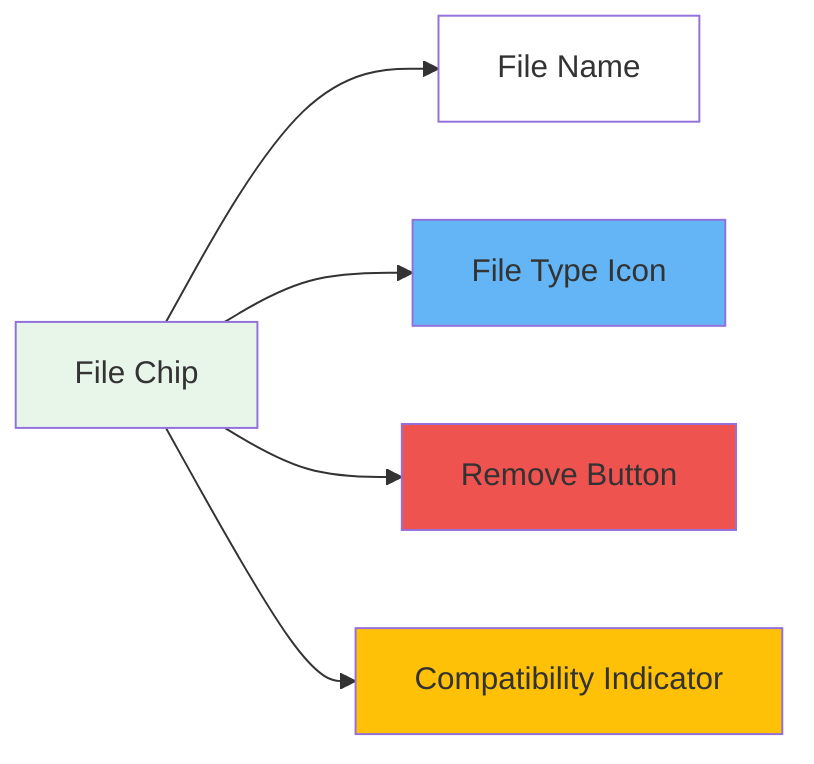

# Managing Context Files in Notebooks

Learn how to enhance your AI interactions by adding files as contextual knowledge to your notebooks.

## What are Context Files?

Context files are documents you attach to your notebook that provide additional knowledge and information for the AI. When you add files to your notebook, the AI can reference their content to provide more accurate and relevant responses.

## Adding Files to Your Notebook

### Method 1: Upload New Files
1. Click the **Add Files** button in your notebook
2. Select files from your computer
3. Files will appear as chips below the input area

### Method 2: Select Existing Files
1. Click the **Knowledge Base** icon
2. Browse or search your existing files
3. Select files to add to the current notebook

## The WorkBench Interface

Once files are added, they appear in the WorkBench area:

### File Chip Features

- **📄 Type Icons**: Visual indicators showing file type (PDF, text, code, etc.)
- **✅ Green Chips**: File is compatible with current model
- **⚠️ Gray Chips**: File type not supported by selected model
- **🔧 Auto-detected Badge**: Files without extensions are auto-detected as text
- **❌ Remove Button**: Click to remove file from context

## Auto-Hide Behavior

The WorkBench automatically manages screen space:

1. **Auto-collapse**: Files hide after 10 seconds of inactivity
2. **Collapsed View**: Shows folder icon with file count badge
3. **Expand**: Click the folder icon to view files again
4. **Activity Reset**: Any interaction resets the 10-second timer

## File Compatibility

### Text Models
✅ Supported:
- Text files (.txt, .md)
- Documents (.pdf)
- Code files (.json, .js, .py)
- Data files (.csv)

❌ Not Supported:
- Images (unless model has vision)
- Audio files
- Video files

### Vision Models
✅ Additionally Supports:
- Images (.jpg, .png, .gif)
- Screenshots
- Diagrams

## How Files Affect AI Responses

When you send a message, the AI:

1. **Reads all attached files**
2. **Extracts relevant information**
3. **Uses content to enhance responses**
4. **Maintains context across conversation**

### Example Use Cases

- **Research**: Attach research papers for analysis
- **Coding**: Include code files for debugging help
- **Writing**: Add reference documents for content creation
- **Data Analysis**: Upload CSV files for insights

## Best Practices

### Do's ✅
- **Be Selective**: Only attach relevant files
- **Organize**: Remove files no longer needed
- **Check Compatibility**: Ensure model supports file type
- **Update Context**: Add new files as conversation evolves

### Don'ts ❌
- **Overload**: Too many files can slow responses
- **Large Files**: Extremely large files may hit limits
- **Sensitive Data**: Be cautious with confidential information
- **Unrelated Files**: Avoid adding irrelevant context

## Managing Multiple Files

### File Limits
- **Recommended**: 5-10 files per notebook
- **Maximum**: Varies by subscription tier
- **Token Consideration**: More files = more tokens used

### Organization Tips
1. **Group Related Files**: Keep similar content together
2. **Remove Outdated**: Clean up as you progress
3. **Name Clearly**: Use descriptive file names
4. **Version Control**: Replace old versions with new

## Troubleshooting

### Files Not Appearing
- Refresh the page
- Check file upload completed
- Verify file format is supported

### Model Warnings
- Switch to a compatible model
- Remove unsupported files
- Check model capabilities

### Performance Issues
- Reduce number of files
- Use smaller file sizes
- Clear unnecessary context

## Advanced Features

### System Files
Some files can be set as "system files" that automatically attach to all notebooks:
- Global prompts
- Personal preferences
- Common reference materials

### Project Files
When working in a project, additional context includes:
- Project-wide documents
- Shared knowledge base
- Team resources

## Tips for Effective File Usage

1. **Start Small**: Begin with 1-2 key files
2. **Iterate**: Add files as needs emerge
3. **Review Regularly**: Remove outdated context
4. **Test Impact**: See how files affect responses
5. **Save Configurations**: Keep successful file combinations

## Privacy and Security

- Files remain private to your account
- Shared notebooks include file access
- Enterprise accounts have additional controls
- Files are encrypted in storage

## Coming Soon

- 🔍 **File Search**: Search within attached files
- 📁 **Folders**: Organize files in collections
- 🔄 **Auto-sync**: Keep files updated automatically
- 🤖 **Smart Suggestions**: AI-recommended files
- 📊 **Usage Analytics**: See which files are most helpful 