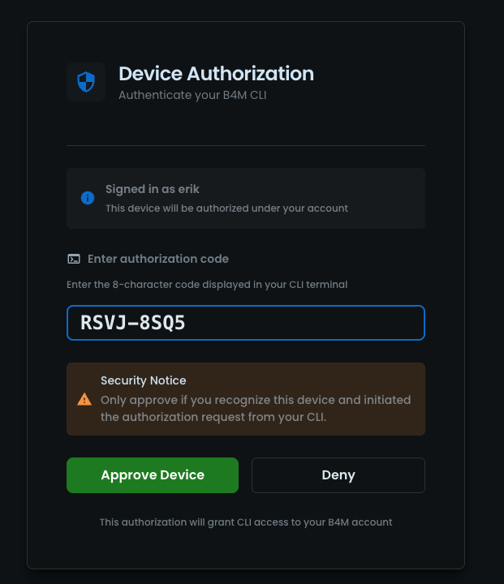
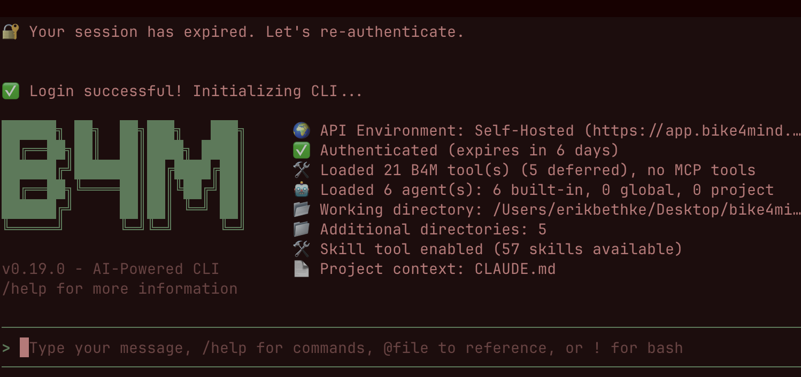
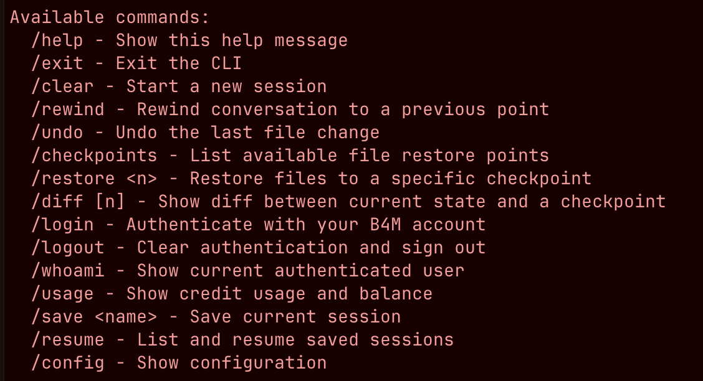
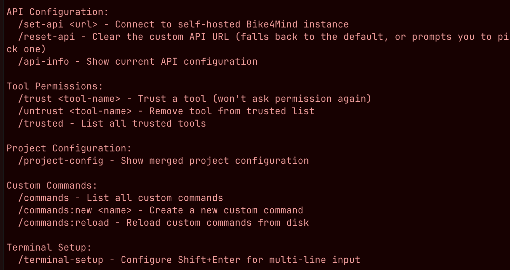
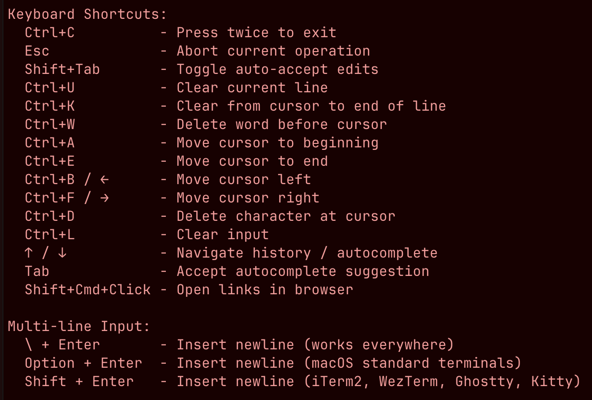
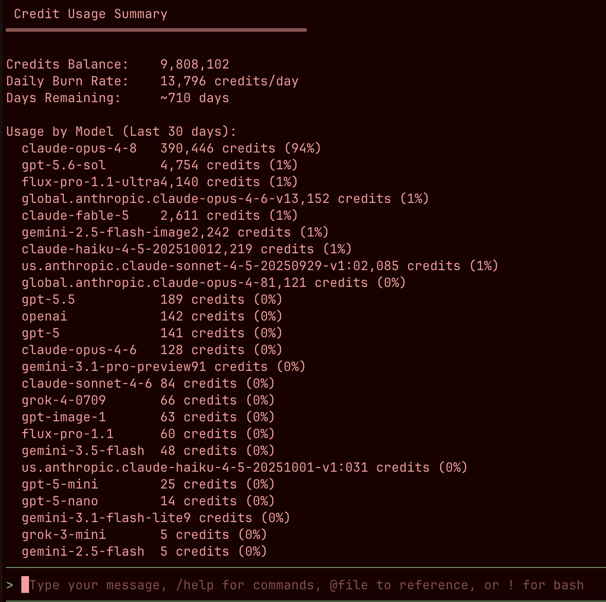

# 🚲 B4M CLI — How-To Guide

*Getting the Bike4Mind CLI up and running, from zero to authenticated agent.*

The B4M CLI (`@bike4mind/cli`) is an interactive, AI-powered command-line
interface for Bike4Mind, built around a ReAct agent. It gives you:

- 🤖 A ReAct agent with reasoning and tool use (21 B4M tools + MCP integration)
- 💬 An interactive chat interface with a rich terminal UI (Ink)
- 💾 Session persistence and per-environment auth
- 📄 Project context loading (`CLAUDE.md`, `AGENTS.md`, `AI.md`)
- 📁 `@` file references with autocomplete, image paste/drag-and-drop
- 🧰 Headless mode for scripts and CI

It lives in the monorepo at `packages/cli` and requires **Node >= 24**.

---

## 1. Installation

### Option A — From npm (recommended for everyday use)

```bash
npm install -g @bike4mind/cli    # installs the `b4m` and `bike4mind` binaries
# or run one-off without installing:
npx @bike4mind/cli
```

### Option B — From source (development)

From the repo root:

```bash
pnpm install
cd packages/cli && pnpm dev          # runs B4M_SOURCE_MODE=1 tsx src/index.tsx
# or from anywhere in the repo:
pnpm --filter @bike4mind/cli dev
```

The bin script (`packages/cli/bin/bike4mind-cli.mjs`) **auto-detects source
mode**: if no `dist/` build exists, it runs the TypeScript source directly via
`tsx`. That means a source checkout always runs whatever is on your current
branch — no rebuild step needed.

> **Native deps:** the CLI uses `better-sqlite3` (image caching) and `sharp`
> (image processing). These compile during install; if bindings ever complain,
> run `pnpm rebuild better-sqlite3` or check `b4m doctor`.

### Make `b4m` available everywhere (shell alias)

To run the source checkout from any directory, add an alias to your shell rc
file (`~/.zshrc` or `~/.bashrc`), substituting the path to your clone:

```bash
# b4m — Bike4Mind CLI, run from source (works from any cwd)
alias b4m='node /path/to/bike4mind/packages/cli/bin/bike4mind-cli.mjs'
```

Then `source ~/.zshrc` (or open a new terminal) and verify:

```bash
b4m --version    # → 0.19.0
```

The alias keeps your current working directory, so the agent operates on
whatever project you're standing in.

---

## 2. First run & authentication

Start an interactive session:

```bash
b4m
```

On first run (or when a session expires) the CLI walks you through a **device
authorization** flow: it displays an 8-character code in the terminal and opens
the Bike4Mind web app, where you confirm the code and approve the device under
your account.



Only approve if you recognize the device and initiated the request from your
own CLI — the approval grants that CLI access to your B4M account.

Once approved, the CLI initializes and drops you into the chat UI:



The startup banner is your at-a-glance status check:

| Line | What it tells you |
| --- | --- |
| 🌍 API Environment | Which backend you're pointed at (prod, local dev, or self-hosted) |
| ✅ Authenticated | Auth status and token expiry (tokens are cached per environment) |
| 🛠️ Loaded tools | B4M tools available to the agent, plus any MCP tools |
| 🤖 Loaded agents | Built-in / global / project agents |
| 📁 Working directory | Where the agent operates (plus any `--add-dir` extras) |
| 🧰 Skill tool | Number of skills available |
| 📄 Project context | Context files it found (e.g. `CLAUDE.md`) |

From the prompt: type a message, `/help` for commands, `@file` to reference a
file, or `!` to run a bash command.

---

## 3. Everyday usage

### Seed the first turn from the shell

A bare positional argument seeds **and** submits turn 1, then stays
interactive:

```bash
b4m "summarize the git log"
```

### Switching environments (`--dev` / `--prod`)

```bash
b4m --dev    # local dev server (http://localhost:3001)
b4m --prod   # Bike4Mind production
b4m          # sticky: reuses whichever environment you last selected
```

The choice persists in `~/.bike4mind/config.json`, and **auth tokens are cached
per environment**, so flipping back and forth doesn't force a re-login. The
active environment shows in the startup banner. Single- and double-dash forms
both work (`-dev`/`--dev`); `--local` is an alias for `--dev`.

To point at any other instance (self-hosted stack, AWS deployment, etc.):

```bash
b4m --api-url http://localhost:3000   # sets the URL, clears cached auth, exits
b4m                                   # sign in against the new endpoint
b4m --reset-api                       # back to the built-in default
```

### Headless mode (scripts & CI)

```bash
b4m -p "What is 2+2?" --output-format json
```

| Flag | Effect |
| --- | --- |
| `-p`, `--prompt <query>` | Run a single query non-interactively and exit |
| `--output-format <fmt>` | `text` (default), `json`, or `stream-json` (NDJSON of thoughts/actions/observations) |
| `--dangerously-skip-permissions` | Auto-allow all tool permission prompts (CI/CD only, use with caution) |

### Other useful flags

| Flag | Effect |
| --- | --- |
| `--verbose`, `-v` | Show debug logs in the console (always written to file regardless) |
| `--debug-stream` | Ultra-verbose: log every SSE event (implies `--verbose`) |
| `--no-project-config` | Skip loading project-specific config (`.bike4mind/`) |
| `--add-dir <dir>` | Grant file access to an additional directory (repeatable) |
| `--ollama-host <url>` | Add a local Ollama endpoint's models to the picker |
| `--no-remote-skills` | Skip fetching remote B4M-web skills (local files only) |
| `--help` / `--version` | Help / CLI version |

### Subcommands

```bash
b4m mcp list                              # List configured MCP servers
b4m mcp add <name> -- <command...>        # Add an MCP server
b4m mcp remove <name>                     # Remove an MCP server
b4m mcp enable <name> | disable <name>    # Toggle a server on/off
b4m update                                # Check for and install CLI updates
b4m doctor                                # Diagnose the install (Node, registry, ripgrep, native modules)
```

---

## 4. Slash commands & keyboard shortcuts

Inside a session, `/help` lists everything the CLI can do. The core commands
cover the session lifecycle — clearing, rewinding, checkpointing, and
save/resume — plus auth and usage:



A few worth committing to muscle memory:

- **`/rewind`** rolls the conversation back to a previous point, while
  **`/undo`**, **`/checkpoints`**, **`/restore <n>`**, and **`/diff [n]`** give
  you file-level time travel — see what changed against a checkpoint before
  restoring it.
- **`/save <name>`** and **`/resume`** persist and reopen whole sessions.
- **`/whoami`** and **`/usage`** show who you're signed in as and the credit
  summary from section 5.

Further down the help output are the configuration commands — pointing at a
self-hosted API, trusting tools so they stop prompting, project config, and
custom commands:



Highlights:

- **`/set-api <url>` / `/reset-api` / `/api-info`** — the in-session
  equivalents of the `--api-url` and `--reset-api` flags from section 3.
- **`/trust <tool-name>` / `/untrust` / `/trusted`** — manage which tools run
  without a permission prompt.
- **`/commands`, `/commands:new <name>`, `/commands:reload`** — build your own
  custom slash commands.
- **`/terminal-setup`** — configures Shift+Enter for multi-line input in your
  terminal.

And the keyboard shortcuts — mostly the classic readline bindings, plus a few
CLI-specific ones:



The ones beyond standard readline: **Ctrl+C twice** to exit, **Esc** to abort
the current operation, **Shift+Tab** to toggle auto-accept edits, **Tab** to
accept autocomplete, and **Shift+Cmd+Click** to open links. For multi-line
input, `\` + Enter works everywhere; Shift+Enter works in iTerm2, WezTerm,
Ghostty, and Kitty (run `/terminal-setup` to wire it up).

---

## 5. Keeping an eye on credits

The **`/usage`** command pulls up your **Credit Usage Summary** — balance,
daily burn rate, projected runway, and a per-model breakdown of the last 30
days:



Handy for spotting which models are actually consuming your credits (here,
`claude-opus-4-8` at 94% of the last 30 days) and how long the balance will
last at the current burn rate.

---

## 6. Troubleshooting

| Symptom | Fix |
| --- | --- |
| `Could not locate the bindings file` | `pnpm rebuild better-sqlite3` (the postinstall script usually handles this automatically) |
| Native module weirdness in general | `pnpm rebuild`, or `b4m doctor` for a full diagnostic |
| Wrong/unreachable API endpoint | `b4m --reset-api`, then re-run `b4m` and sign in |
| Session expired | Just run `b4m` — it re-launches the device authorization flow |
| Need build tools | Python 3 + a C++ compiler (Xcode Command Line Tools on macOS) for node-gyp |

---

*Guide assembled 2026-07-16 · CLI v0.19.0 · Full reference: `packages/cli/README.md` in the repo.*
